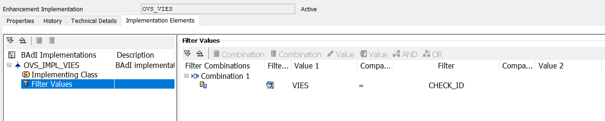

# Business Add-In Implementation

You need to implement the enhancement spot and the BAdI: Online Check BAdI for each validation. 

To create a BAdI implementation, proceed as follows:
1. Go to the SE19 transaction.
2. In the Create Implementation section, select the New BadI option and enter OVS_ENH_CHECK in the Enhancement Spot field. 
3. Select Create.
Enter the name of the enhancement spot and BAdI as needed. 

## Implementation Class
You can use the example class `ZCL_OVS_EXAMPLE` [here](../src/zcl_ovs_example.clas.abap) as the implementation class or as a reference when creating the BAdI:

When you have created the BAdI implementation, enter a BAdI filter (case sensitive) just as the example below:
```
CHECK_ID = <your_check_id>
```
The filter value must be equal to the previously defined CheckID.

Example

