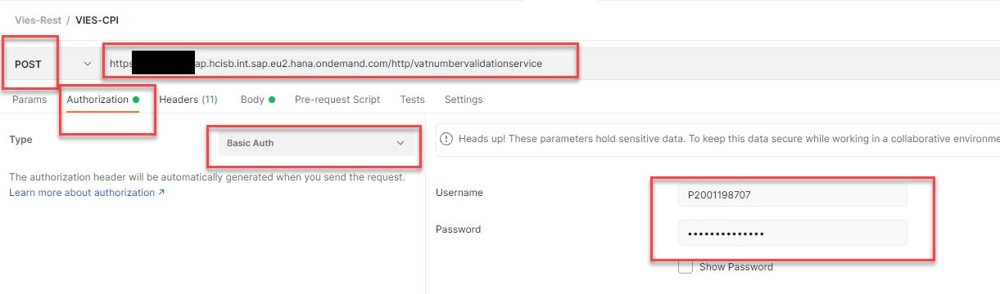

# Testing your iFlow 
This document describes testing whether the VIES relevant iFlow works as expected. If you want to test another iFlow, you will need to change the parameters of the call according to the interface of your iFlow. 

1.	Download and install software that allows API testing, e.g. [Postman](https://www.postman.com/). Alternatively you can choose another tool, some alternatives are listed e.g. [here](https://testsigma.com/blog/postman-alternatives/). 
2.	Deploy the [Integration package]9https://testsigma.com/blog/postman-alternatives/) and configure the connection to the VIES server according to the documents in the package documentation. 
3.	In the API testing tool, create a POST request to your iFlow. 
The URL will be the address of your tenant + iFlow path (in the SM59 for your RFC the tenant address will be equal to the Target Host and iFlow path to the Path prefix) 
4.	In the Authorization tab, select Basic Auth. and maintain your user and password

5.	In the Body tab, provide the request for validation as shown on the picture bellow. 
You can copy+paste the following snippet 
```
<?xml version="1.0" encoding="UTF-8"?>
<VATValReq app="EU">
	<checkVatApprox xmlns="urn:ec.europa.eu:taxud:vies:services:checkVat:types">
		<countryCode>cz</countryCode>
		<vatNumber>49713361</vatNumber>       
	</checkVatApprox>
</VATValReq>
 ```

6.	Send the request and check the response
You shall see `Status code 200 OK`
The body of the response contains information about SAP Czech Republic. 


7.	Sometimes, you might receive an error. In case of VIES errors, the STATUS is still `200 OK`, and the body contains something like: 
```
<faultstring>MS_MAX_CONCURRENT_REQ</faultstring> 
```
Check the documentation on the VIES webste. The error shall be explained there. 

8.	Other errors: 
Communication errors are usually transformed into standard [HTTP error codes](https://www.w3schools.com/tags/ref_httpmessages.asp). In the table bellow you can find the most common ones. 

| HTTP code | Description |
| ----------- | ----------- |
| 404 | Not found: Check the URL of your iFlow, mainly the Path Prefix. |
| 503 | Service Unavailable: Check the URL of your iFlow, mainly the Target Host. |
| 401 or 403 | Unauthorized or Forbidden: Check your authentication credentials. |
| 400 | Bad Request: Check the payload of the request body. |
| 405 | Method not allowed: Check the http request type (e.g. GET used but POST expected). |

